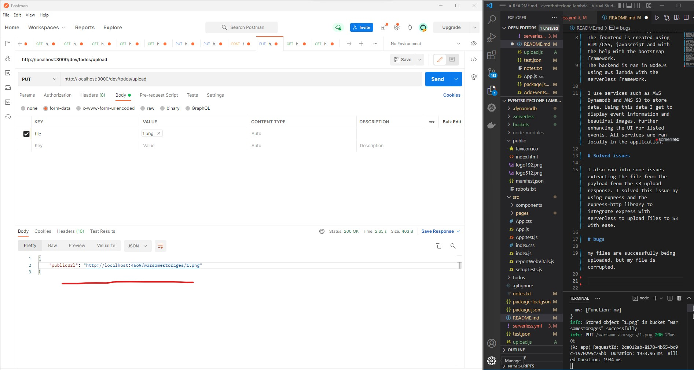
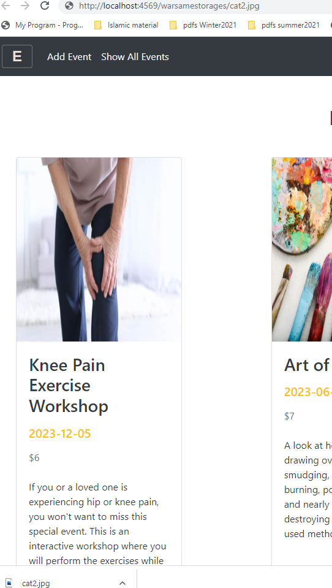
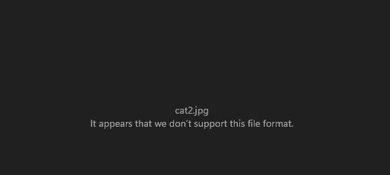

## Eventbriteclone App

This application, similar to the popular company "eventbrite" is a platform to provide information and access to buy tickets to the latest events.

## Description of Eventbriteclone App

This is a fullstack application.
The frontend is created using HTML/CSS, javascript and with the help with the bootstrap framework.
The backend is ran in NodeJs using aws lambda with the serverless framework.

I use services such as AWS Dynamodb and AWS S3 to store data. Using this data I get to display event information and beautiful images, further enhancing the UI for listed events. All services are ran locally in the application.

# Solved issues

I also ran into some issues extracting the file from the payload from the s3 upload response. I solved this issue ny using express and the express-http library to integrate express with serverless to upload files to S3 with ease.

# bugs

my files are successfully being uploaded, but my file is corrupted. thus i cant look at it using my desktop image viewer.

seems like a server issue so im using postman to try to debug it and figure it out.

👇

👇

